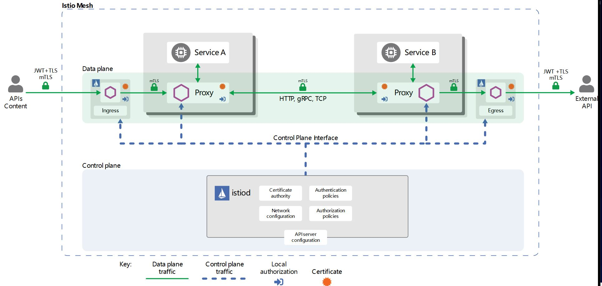

Istio Helper 
---

# Traffic Control
# Security
## Architecture


# Troubleshooting
* Q1:  Error creating: Internal error occurred: failed calling webhook "namespace.sidecar-injector.istio.io": Post "https://istiod.istio-system.svc:443/inject?timeout=10s": unexpected EOF

  A1: api-server is proxy enviornment enabled, remove it by updating /etc/kubernetes/manifests/kube-apiserver.yaml

  https://istio.io/latest/docs/ops/common-problems/injection/

# How to get envoy version in istio env
```
kubectl exec -n bookinfo -ti details-v1-8c8dd4745-kjvts -c istio-proxy -- pilot-agent request GET server_info --log_as_json | jq {version}
{
   "version": "436f365a8007cd8a13a9f1321e7cce94bcc8883e/1.18.3/Clean/RELEASE/BoringSSL"
                                                                                       }
                                                                                        root@k8s-controler-1:~/psp#
```
